# Kubernetes Resilience & High Availability Lab

_Projeto de portfólio orientado a evidências para estudar autoscaling, scheduling e alta disponibilidade em Kubernetes._


[](.github/workflows/validate-kubernetes-yaml.yml)

Este laboratório foi construído para mostrar, de forma prática e verificável, como decisões de autoscaling e scheduling impactam resiliência, previsibilidade operacional e qualidade de execução em Kubernetes.

Mais do que reunir manifests, a proposta aqui é transformar estudo técnico em evidência de engenharia: cenário reproduzível, comandos de validação, screenshots reais e documentação pensada para leitura profissional.

<a id="indice"></a>

## Índice remissivo

- [Visão geral](#visão-geral)
- [Problema que este laboratório resolve](#problema-que-este-laboratório-resolve)
- [Habilidades demonstradas](#habilidades-demonstradas)
- [Arquitetura do laboratório](#arquitetura-do-laboratório)
- [Diagramas do laboratório](#diagramas-do-laboratório)
- [Tópicos abordados](#tópicos-abordados)
- [Estrutura do repositório](#estrutura-do-repositório)
- [Pré-requisitos](#pré-requisitos)
- [Como executar o laboratório](#como-executar-o-laboratório)
- [Como validar os resultados](#como-validar-os-resultados)
- [Evidências e qualidade](#evidências-e-qualidade)
- [Troubleshooting](#troubleshooting)
- [Por que este projeto é relevante para recrutadores?](#por-que-este-projeto-é-relevante-para-recrutadores)
- [Como este projeto se conecta com ambientes reais](#como-este-projeto-se-conecta-com-ambientes-reais)
- [Próximos passos](#próximos-passos)
- [Autor](#autor)

## Visão geral

Este repositório foi estruturado como um laboratório prático para estudar e demonstrar resiliência e alta disponibilidade em Kubernetes com foco em:

- autoscaling horizontal orientado a métricas
- comportamento do scheduler em cenários reais
- distribuição inteligente de Pods entre nodes
- boas práticas de operação e validação com `kubectl`

O objetivo é transformar aprendizado técnico em um projeto de portfólio com rastreabilidade, evidências reais e documentação profissional.

[Voltar ao índice](#indice)

## Problema que este laboratório resolve

Em muitos ambientes, aplicações falham não por falta de containers, mas por:

- distribuição inadequada de cargas entre nodes
- configuração incompleta de escalabilidade
- ausência de regras explícitas de agendamento
- baixa observabilidade para diagnóstico rápido

Este laboratório resolve esse gap com cenários práticos reproduzíveis que mostram como projetar workloads mais resilientes desde o ambiente de estudo.

[Voltar ao índice](#indice)

## Habilidades demonstradas

- modelagem de workloads com foco em disponibilidade
- configuração de HPA com cenários de scale up e scale down
- uso de métricas por container para decisão de escala
- uso avançado de HPA com `ContainerResource` para isolar a métrica do container principal
- aplicação de `nodeSelector`, affinity e anti-affinity
- controle de agendamento com taints e tolerations
- validação técnica com comandos `kubectl`
- organização de evidências e documentação orientada a times técnicos e não técnicos

[Voltar ao índice](#indice)

## Arquitetura do laboratório

Arquitetura base esperada para execução local:

```text
Windows 11 + VS Code
        |
      WSL2 (Ubuntu)
        |
  Docker Desktop Engine
        |
  Cluster local (k3d ou kind)
        |
  kubectl + manifests + scripts
```

Modelo de distribuição:

- 1 node de controle (ou equivalente gerenciado pelo runtime local)
- 2 ou mais nodes de trabalho para testar regras de distribuição e afinidade

[Voltar ao índice](#indice)

## Diagramas do laboratório

Arquivos-fonte em `diagrams/`:

- `diagrams/hpa-flow.md`
- `diagrams/scheduling-flow.md`
- `diagrams/taints-tolerations-flow.md`
- `diagrams/high-availability-overview.md`

### Fluxo do HPA


### Fluxo de Scheduling

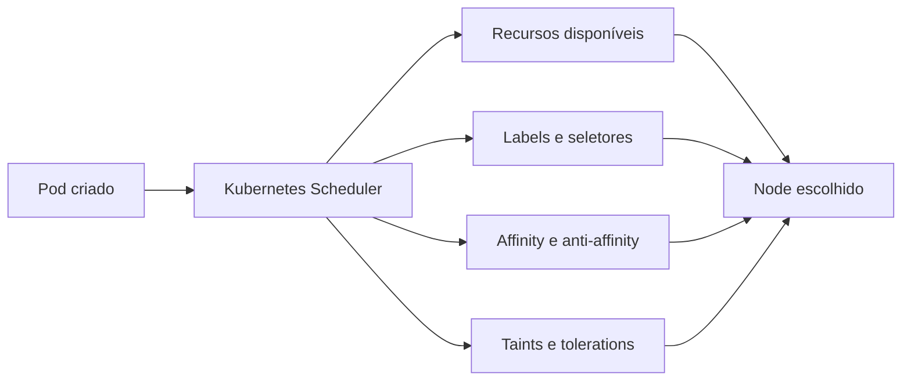

### Fluxo de Taints e Tolerations


### Visão geral de Alta Disponibilidade


[Voltar ao índice](#indice)

## Tópicos abordados

| Tópico de estudo | Módulo prático sugerido | Resultado principal esperado |
|---|---|---|
| HPA Introdução | [manifests/01-hpa-basic](manifests/01-hpa-basic/README.md) | Entender alvo de CPU/memória e comportamento básico do HPA |
| HPA Primeiro Exemplo | [manifests/01-hpa-basic](manifests/01-hpa-basic/README.md) | Primeiro cenário prático de HPA com CPU |
| HPA Scale Up e Scale Down | [manifests/02-hpa-scale-up-down](manifests/02-hpa-scale-up-down/README.md) | Escala horizontal crescente e redução controlada |
| HPA Métricas por container | [manifests/03-hpa-container-metrics](manifests/03-hpa-container-metrics/README.md) | Recurso avançado: escala baseada apenas no container alvo |
| Distribuição dos Pods | [manifests/04-pod-distribution](manifests/04-pod-distribution/README.md) | Pods distribuindo de forma previsível entre nodes |
| `nodeSelector` | [manifests/05-node-selector](manifests/05-node-selector/README.md) | Fixação de Pods em nodes com labels alvo |
| Labels em Nodes | [manifests/05-node-selector](manifests/05-node-selector/README.md) | Organização de capacidade por rótulos para agendamento |
| Node Affinity | [required](manifests/06-node-affinity-required/README.md) e [preferred](manifests/07-node-affinity-preferred/README.md) | Regras obrigatórias e preferenciais para direcionamento de Pods |
| Pod Affinity | [manifests/09-pod-affinity](manifests/09-pod-affinity/README.md) | Co-localização intencional entre workloads |
| Pod Anti Affinity | [manifests/08-pod-anti-affinity](manifests/08-pod-anti-affinity/README.md) | Separação de réplicas para reduzir risco de falha conjunta |
| Taints e Tolerations | [manifests/10-taints-tolerations](manifests/10-taints-tolerations/README.md) | Isolamento de nodes com liberação controlada de agendamento |
| Padrão do Kubernetes | [manifests/11-scheduler-default-behavior](manifests/11-scheduler-default-behavior/README.md) | Entendimento do comportamento default do scheduler |

[Voltar ao índice](#indice)

## Estrutura do repositório

```text
.
|-- README.md
|-- AGENTS.md
|-- LICENSE
|-- .gitignore
|-- docs/
|-- manifests/
|-- scripts/
|-- evidence/
|-- diagrams/
`-- .github/workflows/
```

[Voltar ao índice](#indice)

## Pré-requisitos

- Windows 11
- VS Code
- WSL2 com Ubuntu
- Docker Desktop em execução
- `kubectl` instalado e funcional
- `k3d` ou `kind` instalado
- GitHub CLI (`gh`) opcional para fluxo de publicação

Validações iniciais recomendadas:

```bash
kubectl version --client
docker version
k3d version
kind version
```

[Voltar ao índice](#indice)

## Como executar o laboratório

Scripts disponíveis em `scripts/`:

| Script | Finalidade | Quando usar |
|---|---|---|
| `setup-cluster-k3d.sh` | Cria/reutiliza cluster `k3d` `resilience-ha-lab` com 1 server e 3 agents | Início do laboratório |
| `install-metrics-server.sh` | Instala e ajusta o Metrics Server para ambiente local | Antes dos módulos de HPA |
| `check-cluster.sh` | Valida contexto, nodes, namespaces do lab e metrics API | Checkpoint rápido de ambiente |
| `apply-all.sh` | Aplica manifests em ordem modular (idempotente) | Deploy dos cenários |
| `check-all.sh` | Verifica pods, deployments, services, HPA, labels, taints e eventos | Validação técnica dos resultados |
| `cleanup-all.sh` | Remove recursos do laboratório sem apagar cluster automaticamente | Reset seguro do ambiente |
| `capture-evidence.sh` | Captura saídas reais do `kubectl` em `.txt` dentro de `evidence/logs` | Coleta de evidências para documentação |
| `generate-readme-screenshots.sh` | Regera screenshots PNG do README com saídas reais do cluster | Atualização visual do portfólio |

`check-all.sh`, `capture-evidence.sh` e `cleanup-all.sh` consideram por padrão os namespaces `resilience-hpa` e `resilience-scheduling`.

Fluxo recomendado:

1. Preparar permissão de execução no WSL2, quando necessário.

```bash
chmod +x scripts/*.sh
```

2. Criar cluster local k3d.

```bash
./scripts/setup-cluster-k3d.sh
```

3. Instalar Metrics Server (base para HPA).

```bash
./scripts/install-metrics-server.sh
```

4. Checar estado do cluster.

```bash
./scripts/check-cluster.sh
```

Cluster pronto e saudável no ambiente local:

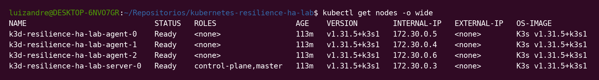

5. Aplicar todos os manifests do laboratório.

```bash
./scripts/apply-all.sh
```

6. Validar recursos e comportamento de scheduling/autoscaling.

```bash
./scripts/check-all.sh
```

7. Capturar evidências reais para o repositório.

```bash
./scripts/capture-evidence.sh
```

Metrics Server ativo e alimentando telemetria para os módulos de HPA:

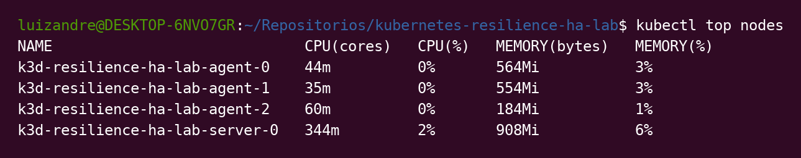

8. Limpar recursos do laboratório, com o cluster preservado por padrão.

```bash
./scripts/cleanup-all.sh
```

Para remover o cluster explicitamente:

```bash
./scripts/cleanup-all.sh --delete-cluster
```

[Voltar ao índice](#indice)

## Como validar os resultados

Comandos de validação técnica recomendados:

```bash
kubectl get hpa -A
kubectl describe hpa <nome-do-hpa> -n <namespace>
kubectl get pods -n <namespace> -o wide
kubectl describe pod <nome-do-pod> -n <namespace>
kubectl get nodes --show-labels
kubectl describe node <nome-do-node>
kubectl get events -n <namespace> --sort-by=.metadata.creationTimestamp
```

Pontos de verificação:

- réplicas aumentam e reduzem conforme carga
- Pods respeitam regras de `nodeSelector` e affinity
- anti-affinity evita concentração de réplicas no mesmo node
- taints bloqueiam agendamento sem toleration correspondente

### Autoscaling horizontal

Estado base dos HPAs aplicados no namespace `resilience-hpa`:

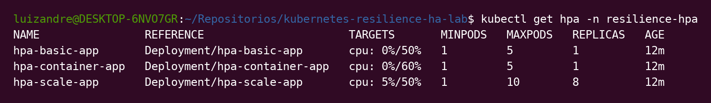

Momento real de scale-up no módulo de carga contínua, com aumento de réplicas no `hpa-scale-app`:

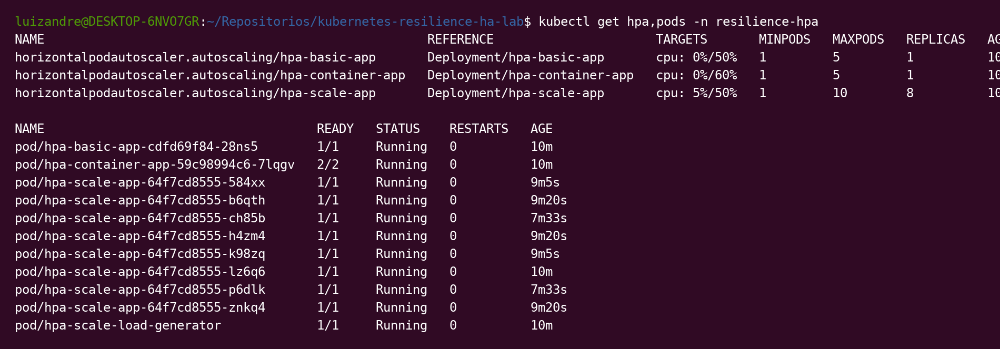

Exemplo de HPA com `ContainerResource`, mostrando a métrica isolada no container principal da aplicação:

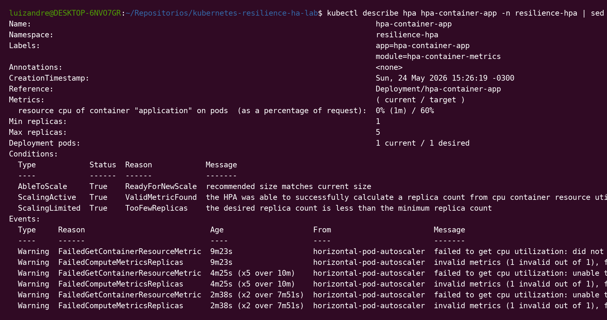

### Scheduling e distribuição

Distribuição de pods no módulo de `topologySpreadConstraints` e distribuição básica:

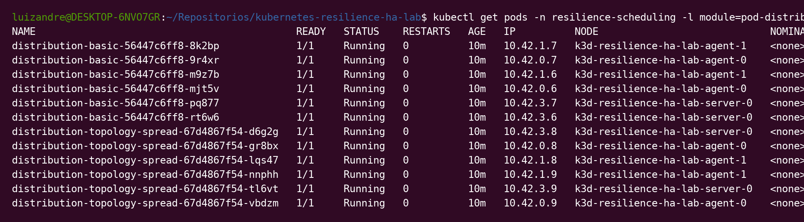

Labels aplicadas nos nodes para direcionar `nodeSelector`, `nodeAffinity` e o cenário de node dedicado:

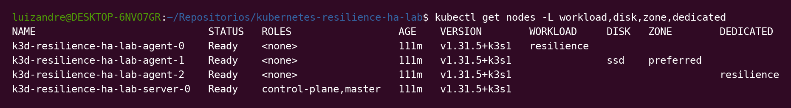

Pods direcionados corretamente por `nodeSelector`, `requiredDuringSchedulingIgnoredDuringExecution` e `preferredDuringSchedulingIgnoredDuringExecution`:

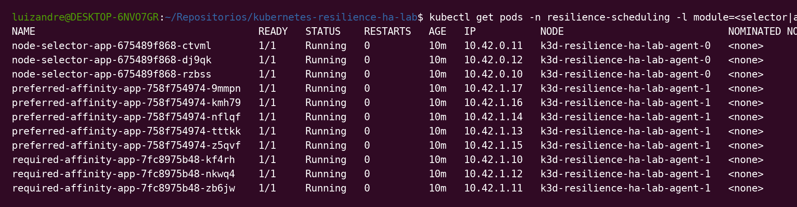

Comportamento de `podAffinity` e `podAntiAffinity` observado no cluster real:

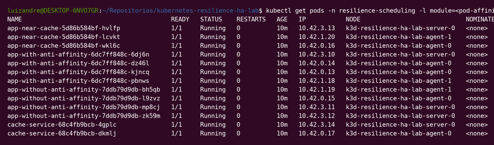

Validação de `taints` e `tolerations`, com um pod agendado no node dedicado e outro bloqueado por `untolerated taint`:

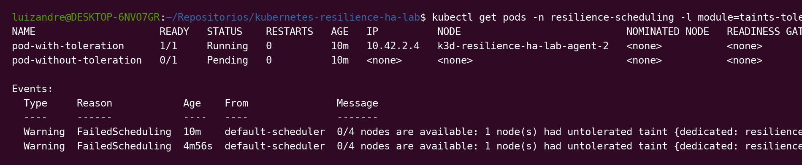

[Voltar ao índice](#indice)

## Evidências e qualidade

Este laboratório foi pensado para ser publicado com evidências reais e verificáveis. As imagens deste `README` foram regeneradas a partir de saídas reais do cluster `k3d-resilience-ha-lab`, com foco nos cenários efetivamente implementados neste repositório: HPA, distribuição de pods, `nodeSelector`, affinities, `taints` e `tolerations`.

O pipeline de qualidade no GitHub Actions complementa essas evidências de execução com validação contínua de YAML e scripts shell:

### Validação contínua no GitHub Actions

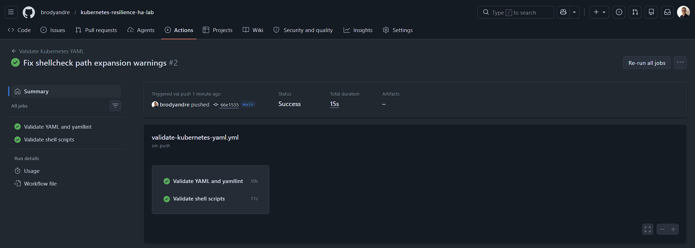

Esse print confirma:

- workflow `Validate Kubernetes YAML` executando na branch `main`
- validação de YAML com `yamllint`
- validação de scripts shell no pipeline
- rastreabilidade entre commit, workflow e resultado final

Para gerar as demais evidências corretas deste laboratório, use os guias abaixo:

- [Guia de evidências](evidence/README.md)
- [Guia de documentação técnica](docs/README.md)
- [Guia de coleta de evidências](docs/EVIDENCE_GUIDE.md)
- [Guia completo de troubleshooting](docs/TROUBLESHOOTING.md)

[Voltar ao índice](#indice)

## Troubleshooting

Guia detalhado: [docs/TROUBLESHOOTING.md](docs/TROUBLESHOOTING.md)

Problema: `kubectl` não conecta no cluster.

- Verificar contexto atual:

```bash
kubectl config current-context
kubectl config get-contexts
```

Problema: HPA não escala.

- Confirmar metrics server e requests/limits definidos no workload:

```bash
kubectl get apiservices | grep metrics
kubectl describe hpa <nome-do-hpa> -n <namespace>
kubectl describe deployment <nome-deployment> -n <namespace>
```

Problema: Pod não agenda no node esperado.

- Inspecionar labels, taints e eventos do Pod:

```bash
kubectl get nodes --show-labels
kubectl describe node <nome-do-node>
kubectl describe pod <nome-do-pod> -n <namespace>
```

[Voltar ao índice](#indice)

## Por que este projeto é relevante para recrutadores?

Mais do que listar conceitos de Kubernetes, este laboratório comunica maturidade de execução. Ele mostra alguém que não apenas conhece os objetos da plataforma, mas consegue organizar um ambiente de teste coerente, criar cenários comparáveis, observar comportamento real do cluster e transformar isso em evidência técnica legível.

De forma sutil, este projeto sinaliza competências que costumam importar muito em contexto profissional:

- capacidade de estruturar experimentos técnicos com propósito claro
- cuidado com validação, rastreabilidade e documentação de qualidade
- leitura de comportamento de infraestrutura a partir de métricas, eventos e estado do scheduler
- preocupação com reprodutibilidade, automação e transferência de conhecimento

Em outras palavras, o repositório não tenta apenas “mostrar Kubernetes”; ele evidencia forma de pensar, critério técnico e disciplina de engenharia.

[Voltar ao índice](#indice)

## Como este projeto se conecta com ambientes reais

Os mesmos conceitos aplicados aqui aparecem em produção quando times precisam:

- reduzir indisponibilidade por concentração de réplicas
- controlar custo sem perder capacidade de resposta
- isolar workloads sensíveis em nodes dedicados
- padronizar troubleshooting entre desenvolvimento e operação
- evoluir de deploy básico para plataforma mais resiliente

[Voltar ao índice](#indice)

## Próximos passos

1. Executar todos os módulos em cluster local e preencher `evidence/logs` com outputs reais.
2. Expandir o laboratório com variante de setup para `kind`.
3. Adicionar um módulo extra com HPA baseado em métrica customizada (Prometheus Adapter).
4. Evoluir o CI com checagem de links quebrados no `README.md`.

Como portfólio, este repositório foi desenhado para ser lido em camadas: primeiro pela clareza da proposta, depois pela qualidade da execução e, por fim, pela consistência entre código, evidências e documentação. Esse é o tipo de detalhe que costuma diferenciar um estudo isolado de um entregável com cara de engenharia real.

[Voltar ao índice](#indice)

## Autor

Luiz André de Souza  
LinkedIn: `https://www.linkedin.com/in/luiz-andre-souza-data-engineer/`  
GitHub: `https://github.com/brodyandre`

[Voltar ao índice](#indice)
