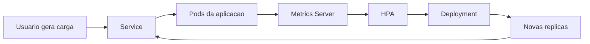
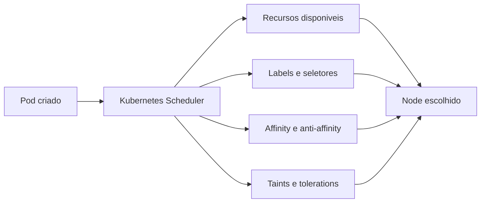
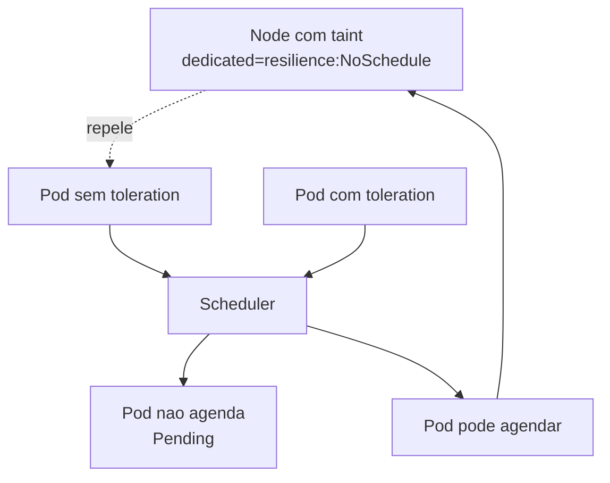
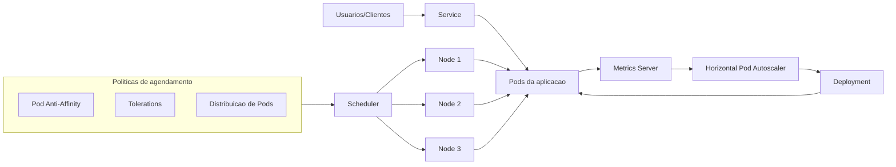

# Kubernetes Resilience & High Availability Lab

_Laboratório prático de autoscaling, scheduling avançado e controle de distribuição de Pods em Kubernetes._


[](.github/workflows/validate-kubernetes-yaml.yml)

## Visão geral

Este repositorio foi estruturado como laboratorio pratico para estudar e demonstrar resiliencia e alta disponibilidade em Kubernetes com foco em:

- autoscaling horizontal orientado a metricas
- comportamento do scheduler em cenarios reais
- distribuicao inteligente de Pods entre nodes
- boas praticas de operacao e validacao com `kubectl`

O objetivo e transformar estudo tecnico em projeto de portifolio com rastreabilidade, evidencias reais e documentacao profissional.

## Problema que este laboratório resolve

Em muitos ambientes, aplicacoes falham nao por falta de containers, mas por:

- distribuicao inadequada de cargas entre nodes
- configuracao incompleta de escalabilidade
- ausencia de regras explicitas de agendamento
- baixa observabilidade para diagnostico rapido

Este laboratorio resolve esse gap com cenarios praticos reproduziveis que mostram como projetar workloads mais resilientes desde o ambiente de estudo.

## Habilidades demonstradas

- modelagem de workloads com foco em disponibilidade
- configuracao de HPA com cenarios de scale up e scale down
- uso de metricas por container para decisao de escala
- uso avancado de HPA com `ContainerResource` para isolar metrica do container principal
- aplicacao de `nodeSelector`, affinity e anti-affinity
- controle de agendamento com taints e tolerations
- validacao tecnica com comandos `kubectl`
- organizacao de evidencias e documentacao orientada a times tecnicos e nao tecnicos

## Arquitetura do laboratório

Arquitetura base esperada para execucao local:

```text
Windows 11 + VS Code
        |
      WSL2 (Ubuntu)
        |
  Docker Desktop Engine
        |
  Cluster local (k3d ou kind)
        |
  kubectl + manifests + scripts
```

Modelo de distribuicao:

- 1 node de controle (ou equivalente gerenciado pelo runtime local)
- 2 ou mais nodes de trabalho para testar regras de distribuicao e afinidade

## Diagramas do laboratório

Arquivos fonte em `diagrams/`:

- `diagrams/hpa-flow.md`
- `diagrams/scheduling-flow.md`
- `diagrams/taints-tolerations-flow.md`
- `diagrams/high-availability-overview.md`

### Fluxo do HPA



### Fluxo de Scheduling



### Fluxo de Taints e Tolerations



### Visão geral de Alta Disponibilidade



## Tópicos abordados

| Topico de estudo | Modulo pratico sugerido | Resultado principal esperado |
|---|---|---|
| HPA Introdução | [manifests/01-hpa-basic](manifests/01-hpa-basic/README.md) | Entender alvo de CPU/memoria e comportamento basico do HPA |
| HPA Primeiro Exemplo | [manifests/01-hpa-basic](manifests/01-hpa-basic/README.md) | Primeiro cenario pratico de HPA com CPU |
| HPA Scale Up e Scale Down | [manifests/02-hpa-scale-up-down](manifests/02-hpa-scale-up-down/README.md) | Escala horizontal crescente e reducao controlada |
| HPA Métricas por container | [manifests/03-hpa-container-metrics](manifests/03-hpa-container-metrics/README.md) | Recurso avancado: escala baseada apenas no container alvo |
| Distribuicao dos Pods | [manifests/04-pod-distribution](manifests/04-pod-distribution/README.md) | Pods distribuindo de forma previsivel entre nodes |
| `nodeSelector` | [manifests/05-node-selector](manifests/05-node-selector/README.md) | Fixacao de Pods em nodes com labels alvo |
| Labels em Nodes | [manifests/05-node-selector](manifests/05-node-selector/README.md) | Organizacao de capacidade por rotulos para agendamento |
| Node Affinity | [required](manifests/06-node-affinity-required/README.md) e [preferred](manifests/07-node-affinity-preferred/README.md) | Regras obrigatorias e preferenciais para direcionamento de Pods |
| Pod Affinity | [manifests/09-pod-affinity](manifests/09-pod-affinity/README.md) | Co-localizacao intencional entre workloads |
| Pod Anti Affinity | [manifests/08-pod-anti-affinity](manifests/08-pod-anti-affinity/README.md) | Separacao de replicas para reduzir risco de falha conjunta |
| Taints e Tolerations | [manifests/10-taints-tolerations](manifests/10-taints-tolerations/README.md) | Isolamento de nodes com liberacao controlada de agendamento |
| Padrão do Kubernetes | [manifests/11-scheduler-default-behavior](manifests/11-scheduler-default-behavior/README.md) | Entendimento do comportamento default do scheduler |

## Estrutura do repositório

```text
.
|-- README.md
|-- AGENTS.md
|-- LICENSE
|-- .gitignore
|-- docs/
|-- manifests/
|-- scripts/
|-- evidence/
|-- diagrams/
`-- .github/workflows/
```

## Pré-requisitos

- Windows 11
- VS Code
- WSL2 com Ubuntu
- Docker Desktop em execucao
- `kubectl` instalado e funcional
- `k3d` ou `kind` instalado
- GitHub CLI (`gh`) opcional para fluxo de publicacao

Validacoes iniciais recomendadas:

```bash
kubectl version --client
docker version
k3d version
kind version
```

## Como executar o laboratório

Scripts disponiveis em `scripts/`:

| Script | Finalidade | Quando usar |
|---|---|---|
| `setup-cluster-k3d.sh` | Cria/reutiliza cluster `k3d` `resilience-ha-lab` com 1 server e 3 agents | Inicio do laboratorio |
| `install-metrics-server.sh` | Instala e ajusta o Metrics Server para ambiente local | Antes dos modulos de HPA |
| `check-cluster.sh` | Valida contexto, nodes, namespaces do lab e metrics API | Checkpoint rapido de ambiente |
| `apply-all.sh` | Aplica manifests em ordem modular (idempotente) | Deploy dos cenarios |
| `check-all.sh` | Verifica pods, deployments, services, HPA, labels, taints e eventos | Validacao tecnica dos resultados |
| `cleanup-all.sh` | Remove recursos do laboratorio sem apagar cluster automaticamente | Reset seguro do ambiente |
| `capture-evidence.sh` | Captura saidas reais do `kubectl` em `.txt` dentro de `evidence/logs` | Coleta de evidencias para documentacao |

`check-all.sh`, `capture-evidence.sh` e `cleanup-all.sh` consideram por padrao os namespaces `resilience-hpa` e `resilience-scheduling`.

Fluxo recomendado:

1. Preparar permissao de execucao no WSL2 (quando necessario).

```bash
chmod +x scripts/*.sh
```

2. Criar cluster local k3d.

```bash
./scripts/setup-cluster-k3d.sh
```

3. Instalar Metrics Server (base para HPA).

```bash
./scripts/install-metrics-server.sh
```

4. Checar estado do cluster.

```bash
./scripts/check-cluster.sh
```

5. Aplicar todos os manifests do laboratorio.

```bash
./scripts/apply-all.sh
```

6. Validar recursos e comportamento de scheduling/autoscaling.

```bash
./scripts/check-all.sh
```

7. Capturar evidencias reais para o repositorio.

```bash
./scripts/capture-evidence.sh
```

8. Limpar recursos do laboratorio (cluster preservado por padrao).

```bash
./scripts/cleanup-all.sh
```

Para remover o cluster explicitamente:

```bash
./scripts/cleanup-all.sh --delete-cluster
```

## Como validar os resultados

Comandos de validacao tecnica recomendados:

```bash
kubectl get hpa -A
kubectl describe hpa <nome-do-hpa> -n <namespace>
kubectl get pods -n <namespace> -o wide
kubectl describe pod <nome-do-pod> -n <namespace>
kubectl get nodes --show-labels
kubectl describe node <nome-do-node>
kubectl get events -n <namespace> --sort-by=.metadata.creationTimestamp
```

Pontos de verificacao:

- replicas aumentam e reduzem conforme carga
- Pods respeitam regras de `nodeSelector` e affinity
- anti-affinity evita concentracao de replicas no mesmo node
- taints bloqueiam agendamento sem toleration correspondente

## Evidências esperadas

As evidencias devem ser reais e coletadas manualmente apos execucao:

- screenshots de estado de HPA e distribuicao de Pods
- logs de comandos `kubectl` relevantes para cada modulo
- eventos de scheduler para justificar comportamento observado

Referencias:

- [Guia de evidencias](evidence/README.md)
- [Guia de documentacao tecnica](docs/README.md)
- [Guia de coleta de evidencias](docs/EVIDENCE_GUIDE.md)
- [Guia completo de troubleshooting](docs/TROUBLESHOOTING.md)

## Troubleshooting

Guia detalhado: [docs/TROUBLESHOOTING.md](docs/TROUBLESHOOTING.md)

Problema: `kubectl` nao conecta no cluster.

- Verificar contexto atual:

```bash
kubectl config current-context
kubectl config get-contexts
```

Problema: HPA nao escala.

- Confirmar metrics server e requests/limits definidos no workload:

```bash
kubectl get apiservices | grep metrics
kubectl describe hpa <nome-do-hpa> -n <namespace>
kubectl describe deployment <nome-deployment> -n <namespace>
```

Problema: Pod nao agenda no node esperado.

- Inspecionar labels, taints e eventos do Pod:

```bash
kubectl get nodes --show-labels
kubectl describe node <nome-do-node>
kubectl describe pod <nome-do-pod> -n <namespace>
```

## Por que este projeto é relevante para recrutadores?

Este repositorio demonstra, de forma pratica e verificavel:

- raciocinio de infraestrutura ao definir regras de agendamento e escalabilidade
- troubleshooting orientado a causa raiz com leitura de eventos e estado do cluster
- automacao inicial com scripts e organizacao de modulos
- documentacao tecnica clara para transferencia de conhecimento
- boas praticas de padronizacao, rastreabilidade e revisao
- capacidade de transformar estudo em projeto real, com entregavel reprodutivel

## Como este projeto se conecta com ambientes reais

Os mesmos conceitos aplicados aqui aparecem em producao quando times precisam:

- reduzir indisponibilidade por concentracao de replicas
- controlar custo sem perder capacidade de resposta
- isolar workloads sensiveis em nodes dedicados
- padronizar troubleshooting entre desenvolvimento e operacao
- evoluir de deploy basico para plataforma mais resiliente

## Próximos passos

1. Executar todos os modulos em cluster local e preencher `evidence/logs` com outputs reais.
2. Ajustar a secao `Autor` com dados reais para publicacao no GitHub.
3. Expandir o laboratorio com variante de setup para `kind`.
4. Adicionar um modulo extra com HPA baseado em metrica customizada (Prometheus Adapter).
5. Evoluir o CI com checagem de links quebrados no `README.md`.

## Autor

Seu Nome  
LinkedIn: `https://www.linkedin.com/in/seu-perfil`  
GitHub: `https://github.com/seu-usuario`
