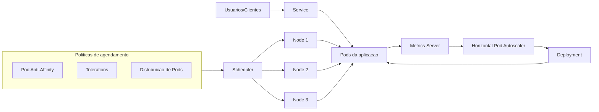

# High Availability Overview

```mermaid
flowchart LR
  U[Usuarios/Clientes] --> SVC[Service]
  SVC --> PODS[Pods da aplicacao]
  PODS --> MS[Metrics Server]
  MS --> HPA[Horizontal Pod Autoscaler]
  HPA --> DEP[Deployment]
  DEP --> PODS

  subgraph POLICIES[Politicas de agendamento]
    AA[Pod Anti-Affinity]
    TOL[Tolerations]
    SPD[Distribuicao de Pods]
  end

  POLICIES --> SCH[Scheduler]
  SCH --> N1[Node 1]
  SCH --> N2[Node 2]
  SCH --> N3[Node 3]
  N1 --> PODS
  N2 --> PODS
  N3 --> PODS
```
