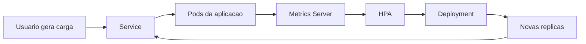

# HPA Flow

```mermaid
flowchart LR
  U[Usuario gera carga] --> S[Service]
  S --> P[Pods da aplicacao]
  P --> M[Metrics Server]
  M --> H[HPA]
  H --> D[Deployment]
  D --> R[Novas replicas]
  R --> S
```
