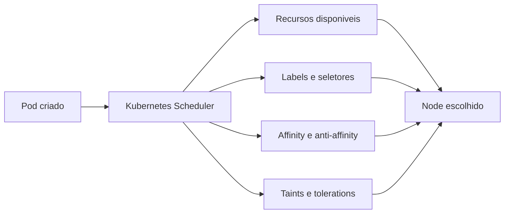

# Scheduling Flow

```mermaid
flowchart LR
  P[Pod criado] --> K[Kubernetes Scheduler]
  K --> R[Recursos disponiveis]
  K --> L[Labels e seletores]
  K --> A[Affinity e anti-affinity]
  K --> T[Taints e tolerations]
  R --> N[Node escolhido]
  L --> N
  A --> N
  T --> N
```
