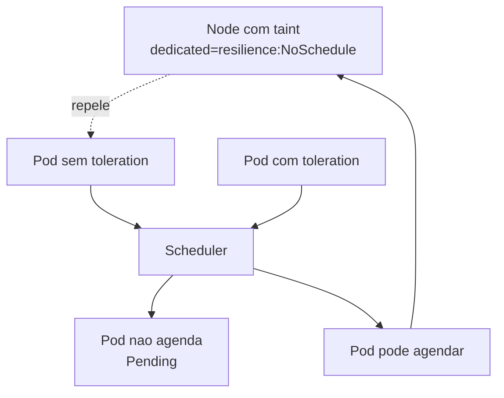

# Taints and Tolerations Flow

```mermaid
flowchart TD
  N[Node com taint<br/>dedicated=resilience:NoSchedule]
  P1[Pod sem toleration]
  P2[Pod com toleration]
  X[Pod nao agenda<br/>Pending]
  S[Scheduler]
  OK[Pod pode agendar]

  N -. repele .-> P1
  P1 --> S --> X
  P2 --> S --> OK
  OK --> N
```
